---

## `❯ whoami`

I'm **RevoJava**, a student at **42** in France. I like understanding how things work under the hood, so I tend to rebuild them myself: a rasterizer instead of a GPU API, a Wayland client instead of SDL, a firmware tool instead of a vendor app.

- 🧱 Currently building a **CPU voxel engine** in C (rasterizer, physics, maths) on top of my own windowing lib
- 🌋 Co-author of **[Volcanic](https://github.com/NelWenn/Volcanic)**, a Vulkan rendering engine for Minecraft, where I built the plugin system and the shader pipeline
- 🐧 Daily driving Linux and fixing the hardware quirks that come with it
- 💬 Ask me about C, Vulkan, Wayland, Minecraft modding or Linux laptop hacks

---

## `❯ ls ~/projects`

### `./systems`

| Project | Description | Stack |
|---|---|---|
| [**MSI-mux-switch-controller**](https://github.com/RevoIDE/MSI-mux-switch-controller) | CLI to switch the GPU MUX (hybrid / discrete / integrated) on MSI laptops under Linux by reading and writing the UEFI variable and the Embedded Controller, with backup, restore, cancel and dry-run | C |
| [**Xway-lib**](https://github.com/RevoIDE/Xway-lib) | Lightweight C11 library for native Wayland windows: software framebuffer, keyboard & mouse input, pointer capture, frame pacing | C · Wayland · CMake |
| [**Deckart**](https://github.com/RevoIDE/Deckart) | Tiny gaming shell for Linux: a Wayland compositor built on Vulkan | C · Vulkan · Wayland |
| [**lenovo-14wgen2-touchpad-fix**](https://github.com/RevoIDE/lenovo-14wgen2-touchpad-fix) | One-command patch for the broken ACPI table that kills the touchpad on the Lenovo 14w Gen 2 | Shell · ACPI |
| [**KDE-clearWin**](https://github.com/RevoIDE/KDE-clearWin) | KWin script that adds configurable window transparency | JavaScript · KWin |

### `./graphics`

| Project | Description | Stack |
|---|---|---|
| [**CPU-voxel-engine**](https://github.com/RevoIDE/CPU-voxel-engine) | Complete voxel engine running entirely on the CPU: rasterizer, physics engine, maths library, rendered through Xway-lib | C · CMake |
| [**Volcanic**](https://github.com/NelWenn/Volcanic) | Cross-platform Vulkan engine for Minecraft (VulkanMod fork) with macOS support. **Co-author**: I designed the plugin system and the native shader pipeline | Java · Vulkan · NeoForge |
| [**Volcanic-Plugin-Template**](https://github.com/RevoIDE/Volcanic-Plugin-Template) | Starter template to write your first Volcanic shader plugin | Java · Shell |

### `./modding`

| Project | Description | Stack |
|---|---|---|
| [**SpigotPro**](https://github.com/RevoIDE/SpigotPro) | Helper API to write Spigot plugins faster | Java |
| [**Gmod-team-deathmatch**](https://github.com/RevoIDE/Gmod-team-deathmatch) | Team deathmatch gamemode for Garry's Mod | Lua |
| [**Gmod-SimpleMinimap**](https://github.com/RevoIDE/Gmod-SimpleMinimap) | Simple minimap addon for Garry's Mod | Lua |
| [**Ark-Ascended-Pufferpanel-Template**](https://github.com/RevoIDE/Ark-Ascended-Pufferpanel-Template) | PufferPanel template to host ARK: Survival Ascended servers on Linux via Proton GE | JSON · Proton |

---

## `❯ cat stack.toml`

**Languages** 

**Graphics & systems** 

**Modding** 

**Tools** 
 

---

## `❯ top --user RevoIDE`

---

## `❯ ping revojava`

 

